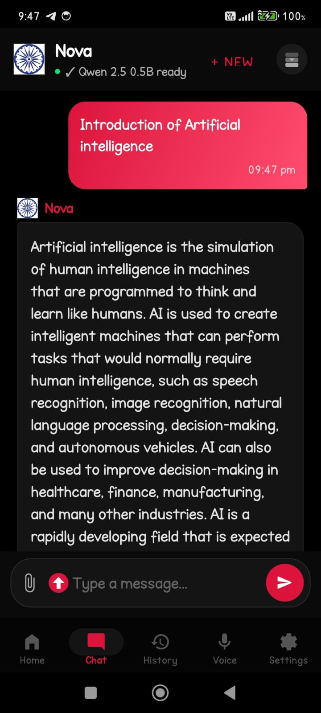
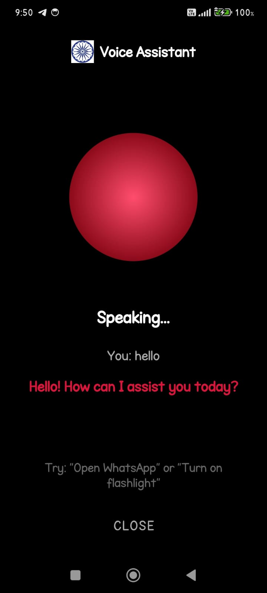
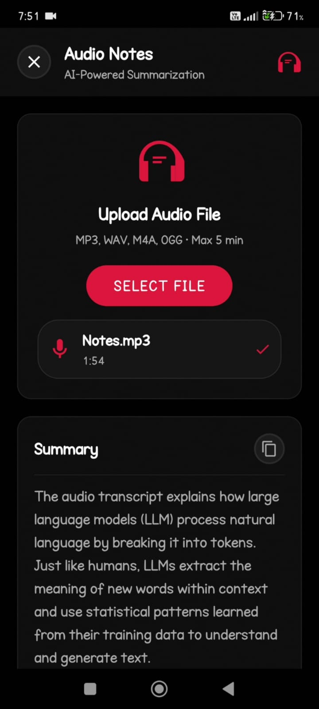
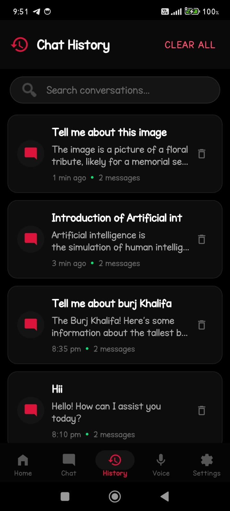
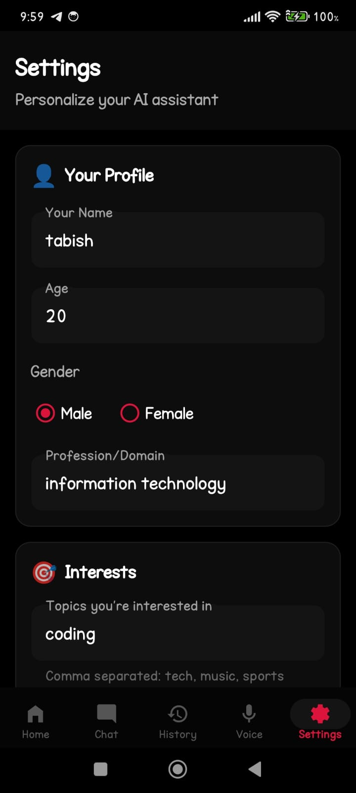

# Nova - Offline AI Assistant

<div align="center">


**Your Personal AI Assistant - 100% Offline & Private**

[](https://www.android.com/)
[](https://android-arsenal.com/api?level=26)
[](LICENSE)

[Features](#features) • [Installation](#installation) • [Usage](#usage) • [Models](#ai-models) • [Screenshots](#screenshots)

</div>

---

## Overview

**Nova** is a powerful, feature-rich AI assistant that runs **completely offline** on your Android
device. No internet required, no data sent to servers - your privacy is 100% protected.

With **9+ AI models**, voice recognition, image analysis, and multi-modal capabilities, Nova brings
cutting-edge AI directly to your pocket.

---

## Features

<div align="center">

### 🤖 AI Chat & Intelligence



</div>

- **9+ On-Device AI Models** - SmolLM, Qwen, Llama, Phi, Mistral
- **Real-time Streaming Responses** - See AI generate responses word-by-word
- **Context-Aware Conversations** - Remembers previous messages in session
- **Markdown Formatting** - Bold, italic, code blocks in responses
- **Smart Token Management** - Automatic optimization for speed
- **Performance Boost** - CPU priority & battery optimization
- **One-Click Model Switching** - Change models mid-conversation

---

<div align="center">

### 🎤 Voice Assistant



</div>

- **Offline Voice Recognition** - Powered by Vosk speech recognition
- **Live Transcription** - See your speech converted to text in real-time
- **Text-to-Speech (TTS)** - AI speaks responses aloud
- **10+ Voice Accents** - Indian, US, UK, Australian, Canadian & more
- **Voice Speed & Pitch Control** - Customize to your preference
- **Picture-in-Picture (PiP) Mode** - Voice assistant floats over other apps
- **Animated Voice UI** - Beautiful glowing circle with pulse effects

---

<div align="center">

### 📷 Image & Document Analysis


</div>

- **Image Upload & AI Analysis** - Ask questions about images
- **Optical Character Recognition (OCR)** - Extract text from images
- **Object Detection** - Identify objects in photos using ML Kit
- **PDF Document Analysis** - Read and summarize PDF files
- **Text File Processing** - Analyze .txt, .md, .csv files
- **Multi-Modal Queries** - Combine text, images, and files in one chat

---

<div align="center">

### 🎵 Audio Notes & Transcription



</div>

- **Audio File Upload** - Support for multiple audio formats
- **Speech-to-Text Transcription** - Convert audio to text offline
- **AI Summarization** - Get concise summaries of long recordings
- **Key Points Extraction** - Identify important topics automatically
- **Terminology Detection** - Find technical terms in audio
- **Export Notes** - Download transcriptions as text files

---

<div align="center">

### 💬 Chat Management



</div>

- **Session History** - All conversations saved automatically
- **Resume Old Chats** - Continue any previous conversation
- **New Chat Creation** - Start fresh anytime
- **Delete Conversations** - Remove individual chats
- **Clear All History** - Wipe all data with confirmation
- **Message Copy** - Long-press to copy any message

---

<div align="center">

### ⚙️ Settings & Personalization



</div>

- **Personal Profile** - Name, age, gender, interests
- **Custom AI Instructions** - Guide AI's response style
- **Voice Character Selection** - Choose from 10+ TTS voices
- **Voice Preview** - Test voices before selecting
- **Speed Control** - 0.5x to 2.0x playback speed
- **Pitch Adjustment** - Low to high voice pitch
- **TTS Toggle** - Enable/disable text-to-speech
- **Persistent Settings** - All preferences saved locally

### System & Performance

- **100% Offline Operation** - No internet needed after model download
- **Device Resource Monitoring** - RAM, storage, battery checks
- **Smart Model Recommendations** - Best model suggested for your device
- **Adaptive Performance** - Auto-adjusts based on device tier
- **Battery Optimization** - Warnings for heavy models
- **Crash Prevention** - Memory management & safety checks
- **Dark Mode** - Eye-friendly & battery-saving UI
- **Smooth Animations** - Optimized, glitch-free interface

---

## AI Models

Nova supports **9 powerful AI models** ranging from lightweight to heavy:

| Model | Size | Parameters | Quality | Speed | Best For |
|-------|------|------------|---------|-------|----------|
| SmolLM2 360M | 360 MB | 360M | Basic | Fast | Quick responses, testing |
| Qwen 2.5 0.5B | 500 MB | 500M | Good | Fast | General chat, balanced |
| Llama 3.2 1B Q4 | 800 MB | 1B | Better | Medium | Quality conversations |
| Llama 3.2 1B Q6 | 1.2 GB | 1B | Better | Medium | Higher quality |
| Qwen 2.5 1.5B | 1.5 GB | 1.5B | Good | Medium | Detailed answers |
| Qwen 2.5 3B | 1.8 GB | 3B | Great | Slow | Complex reasoning |
| Llama 3.2 3B | 2 GB | 3B | Excellent | Slow | High quality responses |
| Phi-3 Mini | 2.3 GB | 3.8B | Great | Slow | Technical knowledge |
| Mistral 7B | 4 GB | 7B | Excellent | Very Slow | Best quality |

**Device Recommendations:**

- **Low-end devices** (2-3 GB RAM): SmolLM2, Qwen 0.5B
- **Mid-range devices** (4-6 GB RAM): Llama 1B, Qwen 1.5B
- **High-end devices** (8+ GB RAM): Qwen 3B, Llama 3B, Phi-3
- **Flagship devices** (12+ GB RAM): Mistral 7B

---

## Installation

### Method 1: Download APK (Recommended)

1. Go to [GitHub Releases](https://github.com/YOUR_USERNAME/Nova/releases)
2. Download `Nova-v1.0.0.apk` (225 MB)
3. Enable "Install from unknown sources" in phone settings
4. Install the APK
5. Open Nova and download an AI model

### Method 2: Build from Source

```bash
# Clone the repository
git clone https://github.com/Sumit0ubey/Nova.git
cd Nova

# Build the APK
./gradlew assembleDebug

# Install on connected device
adb install -r app/build/outputs/apk/debug/app-debug.apk
```

---

## Quick Start

### Step 1: First Launch

When you open Nova for the first time:

1. Splash Screen with animated intro
2. Home Screen with model list
3. Download a model based on your device RAM

### Step 2: Download Your First Model

**Recommended for beginners:** Qwen 2.5 0.5B (500 MB) - Best balance of quality & speed

**Steps:**

1. Go to Home tab
2. Find "Qwen 2.5 0.5B" model
3. Tap "Download" button
4. Wait for download to complete
5. After download, tap "Load"
6. Wait for "Model ready to chat!" message

### Step 3: Start Chatting

1. Go to Chat tab
2. Type a message: "What is artificial intelligence?"
3. Tap Send button
4. Watch AI response stream in real-time

---

## Usage Guide

### Chat with AI

**Basic Chat:**

```
You: What is quantum computing?
AI: Quantum computing is a type of computation that uses quantum mechanical 
phenomena like superposition and entanglement to perform calculations...
```

**Follow-up Questions:**

```
You: What is quantum computing?
AI: [Explains quantum computing]

You: How is it different from classical computing?
AI: [Uses context from previous answer to explain differences]
```

**Actions:**

- Long-press any message to copy it
- Tap "+ New" button to start fresh conversation
- Tap model icon to switch models mid-conversation

---

### Image Analysis

1. Tap attachment button in chat
2. Select an image from gallery
3. Wait for analysis (shows preview with thumbnail)
4. Type your question: "What's in this image?"
5. AI analyzes and responds

**Supported formats:** JPG, PNG, WebP, BMP, GIF

**Example:**

```
[Upload: Screenshot of code]
You: Explain this code
AI: This code shows a Python function that calculates fibonacci numbers...
```

---

### Document Analysis

1. Tap attachment button
2. Select PDF/TXT/MD/CSV file
3. File preview appears with name and size
4. Type question: "Summarize this document"
5. AI reads and summarizes

**Supported formats:** PDF, TXT, MD, CSV, JSON

---

### Voice Assistant

1. Go to Home tab
2. Tap "Voice Assistant" card
3. Tap the glowing voice circle
4. Speak your question
5. See live transcription appear
6. AI processes and speaks response

**PiP Mode:**

1. Start voice assistant
2. Press Home button on phone
3. Voice assistant becomes floating window
4. Works over any app
5. Tap window to return to full screen

---

### Audio Notes

1. Go to Home tab
2. Tap "Audio Notes" card
3. Tap "Select Audio File"
4. Choose audio recording
5. Tap "Analyze Audio"
6. Wait for processing

**Results include:**

- Full Transcription - Complete text of audio
- AI Summary - Concise overview
- Key Points - Important topics
- Terminology - Technical terms detected

---

### Chat History

1. Go to History tab
2. View all previous chats with title, preview, timestamp
3. Tap any chat to resume
4. Long-press to delete
5. "Clear All" button to delete everything

---

### Settings & Personalization

**Personal Info:**

```
Name: Mohammad
Age: 25
Gender: Male
Interests: coding, AI, technology
```

**Custom Instructions:**

```
"Reply in a friendly and conversational tone"
"Keep answers under 3 sentences"
"Explain technical terms simply"
```

**Voice Settings:**

1. Select Voice Character (Indian, US, UK, Australian, etc.)
2. Adjust Speed (0.5x - 2.0x)
3. Adjust Pitch (0.5 - 2.0)
4. Click "Preview Voice" to test
5. Save settings

---

## Technical Details

### Architecture

```
┌─────────────────────────────────────┐
│         Presentation Layer          │
│  (UI Fragments, Activities, Views)  │
└──────────────┬──────────────────────┘
               │
┌──────────────▼──────────────────────┐
│         ViewModel Layer             │
│  (ChatViewModel, State Management)  │
└──────────────┬──────────────────────┘
               │
┌──────────────▼──────────────────────┐
│         Domain Layer                │
│  (Controllers, Services, Models)    │
└──────────────┬──────────────────────┘
               │
┌──────────────▼──────────────────────┐
│         Data Layer                  │
│  (Repositories, Local Storage)      │
└──────────────┬──────────────────────┘
               │
┌──────────────▼──────────────────────┐
│         External SDKs               │
│  (RunAnywhere, Vosk, ML Kit)        │
└─────────────────────────────────────┘
```

### Key Technologies

| Component | Technology | Purpose |
|-----------|------------|---------|
| AI Inference | RunAnywhere SDK | On-device LLM execution |
| Voice Recognition | Vosk | Offline speech-to-text |
| Image Analysis | ML Kit | OCR & object detection |
| Text-to-Speech | Android TTS | Voice output |
| UI Framework | Android Views | Native UI components |
| Async Operations | Kotlin Coroutines & Flow | Threading & streams |

### Performance Optimizations

- **CPU Priority Boost** - Increases process priority during inference
- **Token Management** - Adaptive limits based on query type
- **Streaming Responses** - Incremental UI updates
- **View Recycling** - Efficient RecyclerView rendering
- **Memory Management** - Proactive resource monitoring
- **Battery Optimization** - Foreground service during heavy tasks

---

## Requirements

### Minimum

- **OS:** Android 8.0 (Oreo, API 26)
- **RAM:** 2 GB (for SmolLM2 360M)
- **Storage:** 1 GB free
- **Permissions:** Storage, Microphone (optional)

### Recommended

- **OS:** Android 10+
- **RAM:** 4 GB+
- **Storage:** 3 GB free
- **CPU:** Octa-core or better

### Optimal

- **OS:** Android 12+
- **RAM:** 8 GB+
- **Storage:** 5 GB+
- **CPU:** Flagship chipset (Snapdragon 8 Gen, Dimensity 9000+)

---

## Privacy & Security

### 100% Offline

- No internet required after model download
- All processing happens on-device
- No data sent to servers
- No analytics or tracking
- Complete privacy guaranteed

### Data Storage

- Chat history: Local SQLite database
- User settings: Encrypted SharedPreferences
- Models: Local file storage
- No cloud sync or backups

### Permissions

- **Storage** - Save/load models and files
- **Microphone** - Voice assistant (optional)
- **Internet** - Download models only (can be revoked after)

---

## Troubleshooting

### App won't open / crashes on startup

- Clear app cache: Settings > Apps > Nova > Clear Cache
- Restart phone
- Reinstall APK

### Model download fails

- Check internet connection
- Ensure sufficient storage space
- Try downloading a smaller model first
- Restart app and retry

### Model won't load

- Check available RAM (need ~2x model size free)
- Close other apps
- Try smaller model
- Restart app

### AI responses very slow

- Normal for on-device AI
- Try smaller/faster model (Qwen 0.5B, Llama 1B)
- Close background apps

### Voice recognition not working

- Grant microphone permission
- Check if microphone works in other apps
- Speak clearly in English
- Reduce background noise

### TTS not speaking

- Go to Settings tab
- Enable "Text-to-Speech" toggle
- Select a voice and click "Preview Voice"
- Check phone volume

### PiP mode not working

- Enable PiP in phone settings: Settings > Apps > Nova > Picture-in-picture > Allow
- Android 8.0+ required

---

## Development

### Build from Source

```bash
# Prerequisites
- Android Studio Hedgehog or later
- JDK 17
- Android SDK 34

# Clone
git clone https://github.com/Sumit0ubey/Nova.git
cd Nova

# Build APK
./gradlew assembleDebug

# Build release APK (signed)
./gradlew assembleRelease
```

### Project Structure

```
Nova/
├── app/
│   ├── src/main/
│   │   ├── java/.../
│   │   │   ├── ui/                   # UI Fragments
│   │   │   ├── domain/               # Business logic
│   │   │   │   ├── model/            # Data models
│   │   │   │   └── service/          # Services
│   │   │   ├── data/                 # Data layer
│   │   │   │   ├── local/            # Database
│   │   │   │   └── repository/       # Repositories
│   │   │   ├── MyApplication.kt      # App initialization
│   │   │   ├── ChatViewModel.kt      # Main ViewModel
│   │   │   └── MainActivity.kt       # Main Activity
│   │   ├── res/                      # Resources
│   │   │   ├── layout/               # XML layouts
│   │   │   ├── drawable/             # Images/icons
│   │   │   └── values/               # Strings/colors
│   │   └── assets/
│   │       └── vosk-model-*/         # Voice model
│   └── build.gradle.kts
├── gradle/
├── gradlew
└── README.md
```

### Key Dependencies

```kotlin
// AI Inference
implementation("ai.runanywhere:sdk:x.x.x")

// Voice Recognition
implementation("com.alphacephei:vosk-android:0.3.47")

// Image Analysis
implementation("com.google.mlkit:text-recognition:16.0.0")
implementation("com.google.mlkit:image-labeling:17.0.7")

// UI Components
implementation("androidx.recyclerview:recyclerview:1.3.2")
implementation("com.google.android.material:material:1.11.0")

// Kotlin
implementation("org.jetbrains.kotlinx:kotlinx-coroutines-android:1.7.3")
```

---

## Contributing

Contributions are welcome! Here's how:

1. Fork the repository
2. Create a feature branch: `git checkout -b feature/AmazingFeature`
3. Commit your changes: `git commit -m 'Add some AmazingFeature'`
4. Push to the branch: `git push origin feature/AmazingFeature`
5. Open a Pull Request

### Areas for Contribution

- Add more language support
- UI/UX improvements
- Bug fixes
- iOS version (React Native / Flutter)
- Desktop version (Electron)
- Documentation improvements

---

## License

This project is licensed under the **MIT License** - see the [LICENSE](LICENSE) file for details.

```
MIT License

Copyright (c) 2025 Nova AI Assistant

Permission is hereby granted, free of charge, to any person obtaining a copy
of this software and associated documentation files (the "Software"), to deal
in the Software without restriction, including without limitation the rights
to use, copy, modify, merge, publish, distribute, sublicense, and/or sell
copies of the Software, and to permit persons to whom the Software is
furnished to do so, subject to the following conditions:

The above copyright notice and this permission notice shall be included in all
copies or substantial portions of the Software.

THE SOFTWARE IS PROVIDED "AS IS", WITHOUT WARRANTY OF ANY KIND, EXPRESS OR
IMPLIED, INCLUDING BUT NOT LIMITED TO THE WARRANTIES OF MERCHANTABILITY,
FITNESS FOR A PARTICULAR PURPOSE AND NONINFRINGEMENT. IN NO EVENT SHALL THE
AUTHORS OR COPYRIGHT HOLDERS BE LIABLE FOR ANY CLAIM, DAMAGES OR OTHER
LIABILITY, WHETHER IN AN ACTION OF CONTRACT, TORT OR OTHERWISE, ARISING FROM,
OUT OF OR IN CONNECTION WITH THE SOFTWARE OR THE USE OR OTHER DEALINGS IN THE
SOFTWARE.
```

---

## Team

<div align="center">

### 👥 Meet the Developers

| Name | Role | GitHub |
|------|------|--------|
| **Tabish Ansari** | Team Leader | [](https://github.com/MdTabish24) |
| **Sumit Dubey** | Developer | [](https://github.com/Sumit0ubey) |
| **Shahid Shaikh** | Developer | [](https://github.com/SnapTexas) |
| **Tanu Pal** | Developer | [](https://github.com/tanutech404) |

</div>

---

## Acknowledgments

- [RunAnywhere SDK](https://github.com/RunanywhereAI/runanywhere-sdks) - On-device AI inference
- [Vosk Speech Recognition](https://alphacephei.com/vosk/) - Offline voice recognition
- [Google ML Kit](https://developers.google.com/ml-kit) - Image analysis
- [Llama.cpp](https://github.com/ggerganov/llama.cpp) - LLM inference engine
- Hugging Face - AI model hosting

---

## Support & Contact

### Issues & Bugs

- [GitHub Issues](https://github.com/YOUR_USERNAME/Nova/issues)
- Include: Device model, Android version, error logs

### Feature Requests

- [GitHub Discussions](https://github.com/YOUR_USERNAME/Nova/discussions)
- Describe use case and expected behavior

---

## Changelog

### v1.0.0 (December 2025)

- Initial release
- 9 AI models supported
- Voice assistant with PiP mode
- Image & document analysis
- Audio transcription & summarization
- 10+ TTS voices
- Full chat history management
- 100% offline operation

---

<div align="center">

**Made with passion for offline AI**

**Star this repo if you found it useful!**

[Back to Top](#nova---offline-ai-assistant)

</div>
